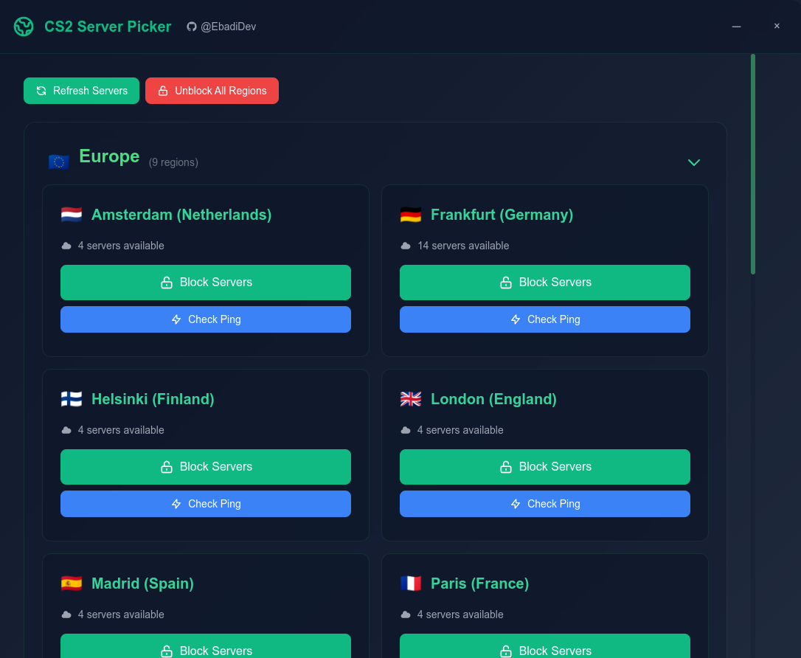
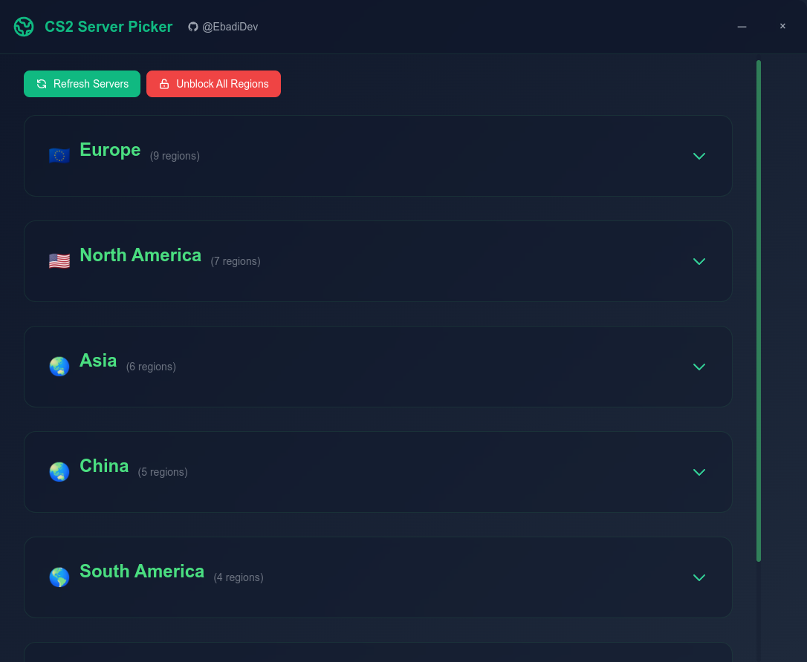
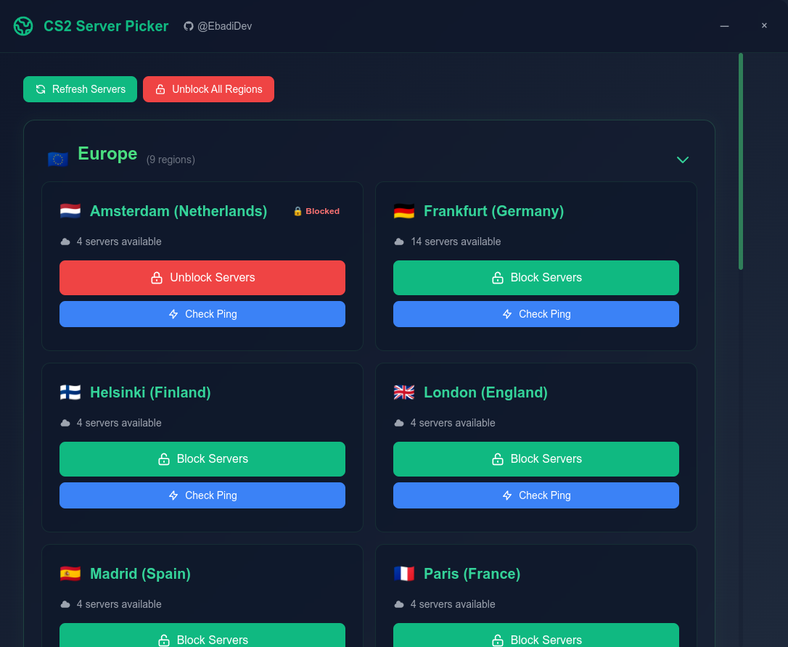
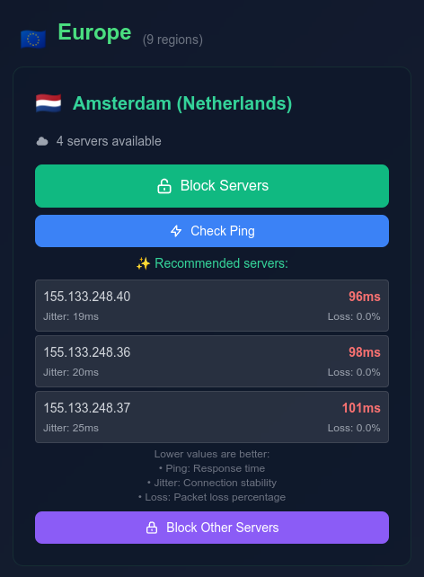

# CS2 Server Picker

A lightweight tool for managing Counter-Strike 2 server connections. Block or allow specific regional servers to optimize your matchmaking experience.

## Features

- 🌍 Block/unblock CS2 servers by region
- 📊 Test server ping and connection quality
- 🔒 Block all servers except recommended ones
- 🚀 Modern Electron-based UI
- 💻 Windows & Linux support
- ⚡ Fast and lightweight

## Screenshots

 
 
 
 

## Installation

1. Download the latest release for your platform from [Releases](https://github.com/EbadiDev/cs2-server-picker/releases)
2. Run the installer
3. Launch CS2 Server Picker

Note: Admin/root privileges required for firewall rules

## Development
#### Clone the repository
```bash
git clone https://github.com/EbadiDev/cs2-server-picker.git
```

#### Install dependencies
```bash
npm install
```

#### Start the app
```bash
npm start
```

#### Build for your platform
```bash
npm run build
```

## How It Works

- Windows: Uses Windows Firewall rules
- Linux: Uses iptables rules
- Blocks UDP port 27015 for selected servers
- Tests connection quality using ping/PSPing